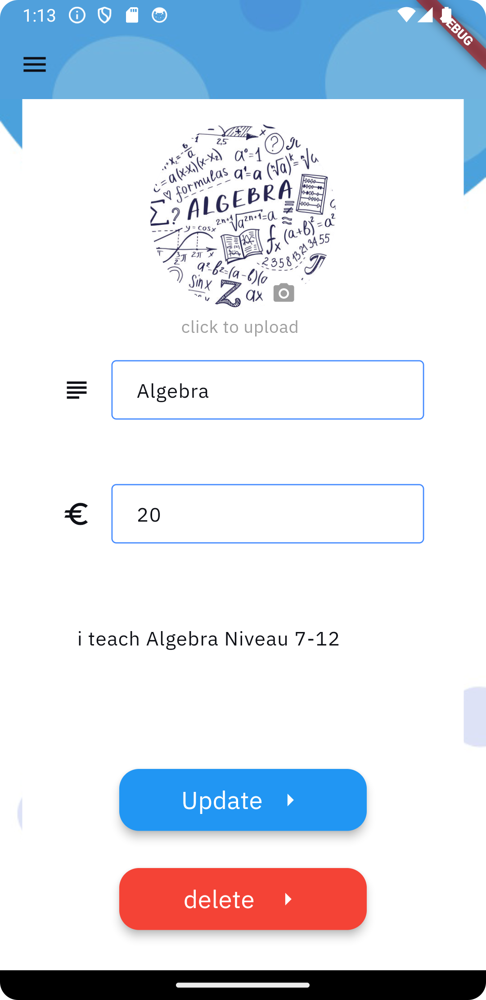

# Tutor Finder App

## Dokumentation Entwicklung mobile Anwendung

### Autoren:
- **Amer Al Aloush**
  
  - E-Mail: inf4049@hs-worms.de
  - Studiengang: Angewandte Informatik

- **Mohammad Gaser**
  
  - E-Mail: inf4024@hs-worms.de
  - Studiengang: Angewandte Informatik

- **Qusai Shikh Ali**
 
  - E-Mail: inf4359@hs-worms.de
  - Studiengang: Angewandte Informatik

## Inhaltsverzeichnis

1. **Einleitung**..........................................................................................3
2. **Installation**.........................................................................................4
   - 2.1 Systemanforderungen...................................................................4
   - 2.2 Voraussetzungen...........................................................................4
   - 2.3 Installationsanleitung...................................................................4
3. **Benutzung**......................................................................................4-6
   - 3.1 Start der App.................................................................................4
   - 3.2 Navigation....................................................................................4
   - 3.3 Funktionen....................................................................................5
   - 3.4 Screenshots...............................................................................5-6
4. **Architektur**.........................................................................................7
   - 4.1 Übersicht......................................................................................7
   - 4.2 Verzeichnisstruktur.......................................................................7
   - 4.3 Datenfluss.....................................................................................7
   - 4.4 State Management.....................................................................7-9
5. **Code-Dokumentation**......................................................................10
   - 5.1 Wichtige Klassen und Funktionen..............................................10
   - 5.2 Kommentare...............................................................................10
   - 5.3 Beispielcode...............................................................................10
6. **Deployment**.....................................................................................10
   - 6.1 Build-Prozess.............................................................................10
   - 6.2 Veröffentlichung.........................................................................10
7. **Anhang**.............................................................................................11
   - 7.1 Ressourcen..................................................................................11
   - 7.2 Danksagungen............................................................................11
8. **Problemlösungen und FAQ**.............................................................11
   - 8.1 Häufige Probleme.......................................................................11
   - 8.2 FAQ............................................................................................11
9. **Projektmanagement-Informationen**.................................................11
   - 9.1 Tools und Methoden..................................................................11

## 1. Einleitung
Die "Tutor Finder" App wurde entwickelt, um Studenten, Schülern und allen, die professionelle Hilfe benötigen, eine Plattform zu bieten, auf der sie qualifizierte Tutoren finden können. Was diese App von anderen unterscheidet, ist die Möglichkeit für Tutoren, spezifische Fächer zu erstellen, beispielsweise Logarithmen in der Kategorie Mathematik, was ihre besonderen Fähigkeiten hervorhebt.

## 2. Installation

### 2.1 Systemanforderungen
- Betriebssystem: Android oder iOS
- RAM: Mindestens 2 GB
- Speicherplatz: Mindestens 100 MB verfügbarer Speicher

### 2.2 Voraussetzungen
- Flutter SDK
- Android Studio oder Xcode

### 2.3 Installationsanleitung
1. Lade das Projekt aus dem Git-Repository herunter.
2. Öffne das Projekt in Android Studio oder Xcode.
3. Installiere alle erforderlichen Abhängigkeiten mit `flutter pub get`.
4. Starte die App mit `flutter run`.

## 3. Benutzung

### 3.1 Start der App
Öffne die App durch Tippen auf das Icon "Tutor Finder" auf deinem Startbildschirm.

### 3.2 Navigation
Die Hauptnavigation erfolgt über eine Sidebar, die die folgenden Abschnitte enthält:
- Startseite
- Kategorien
- Profil
- Abmelde Button

### 3.3 Funktionen
- **Startseite:** Zeigt eine Liste von verfügbaren Tutoren an.
- **Tutor-Profil:** Beim Klicken auf einen Tutor wird das Profil des Tutors angezeigt, inklusive aller angebotenen Fächer und Bewertungen.
- **Kategorie-Filter:** Ermöglicht das Filtern von Fächern nach Kategorien.
- **Profil bearbeiten:** Nutzer können ihre Profildaten wie Bild, Name, Handynummer, Alter etc. ändern.
- **Tutor werden:** Nutzer können eine Anfrage stellen, um Tutor zu werden. Diese Anfrage wird von einem Admin überprüft und freigeschaltet.
- **Fächer erstellen:** Tutoren können Fächer erstellen und modifizieren oder auch löschen.

### 3.4 Screenshots
 




## 4. Architektur

### 4.1 Übersicht
Die App verwendet eine monolithische Architektur, bei der alle Komponenten der Anwendung als eine einzige Einheit organisiert sind. Dies bedeutet, dass die Benutzeroberfläche, die Geschäftslogik und der Datenzugriff in einer einzigen Codebasis integriert sind.

### 4.2 Verzeichnisstruktur          
- lib/
- ├── Models/
- ├── component/
- ├── screen/
- ├── layout-app-menus/
- ├── theme/
- └── widgets/

### 4.3 Datenfluss
Der Datenfluss in der "Tutor Finder" App erfolgt wie folgt:
1. **View zu Controller:** Benutzerinteraktionen (z.B. Klicks) werden von der View an den Controller weitergeleitet.
2. **Controller verarbeitet die Interaktion:** Der Controller enthält die Geschäftslogik, verarbeitet die Interaktion und aktualisiert das Model.
3. **Controller zu Model:** Der Controller aktualisiert die Daten im Model.
4. **Model zu Controller:** Das Model benachrichtigt den Controller über Datenänderungen.
5. **Controller zu View:** Der Controller benachrichtigt die View über Änderungen, sodass die Benutzeroberfläche aktualisiert wird.

### 4.4 State Management
In der "Tutor Finder" App wird FutureBuilder für das State Management verwendet. Hier ist eine detaillierte Erklärung:
- **FutureBuilder:** Ein Flutter-Widget, das eine asynchrone Operation überwacht und den UI-Zustand basierend auf dem Zustand der Operation anpasst.

Wie FutureBuilder funktioniert:
1. **Initialisieren eines Futures:** Der FutureBuilder überwacht einen Future, der eine asynchrone Operation repräsentiert (z.B. das Abrufen von Tutor-Daten aus einer Datenbank).
2. **Bauen des Widgets:** Während der Future in Bearbeitung ist, zeigt der FutureBuilder ein Lade-Widget (z.B. einen Spinner) an. Sobald der Future abgeschlossen ist, zeigt der FutureBuilder die Resultate an.
3. **Automatische Aktualisierung:** Wenn der Future abgeschlossen ist oder sich der Zustand ändert, aktualisiert der FutureBuilder automatisch die Benutzeroberfläche.

## 5. Code-Dokumentation

### 5.1 Wichtige Klassen und Funktionen
- **Main.dart:** Einstiegspunkt der App.
- **AuthService:** Klasse zur Authentifizierung von Nutzern.
- **TutorViewModel:** ViewModel zur Verwaltung der Tutor-Daten.

### 5.2 Kommentare
Kommentare sind im Code integriert, um die Funktionalität zu erklären.

### 5.3 Beispielcode

```dart
class AuthService {
  Future<User> signInWithEmailAndPassword(String email, String password) async {
    // Logik zur Authentifizierung
  }
}

class TutorList extends StatelessWidget {
  @override
  Widget build(BuildContext context) {
    return FutureBuilder<List<Tutor>>(
      future: fetchTutors(),
      builder: (context, snapshot) {
        if (snapshot.connectionState == ConnectionState.waiting) {
          return CircularProgressIndicator();
        } else if (snapshot.hasError) {
          return Text('Error: ${snapshot.error}');
        } else if (snapshot.hasData) {
          return ListView.builder(
            itemCount: snapshot.data.length,
            itemBuilder: (context, index) {
              return ListTile(
                title: Text(snapshot.data[index].name),
                subtitle: Text(snapshot.data[index].subject),
              );
            },
          );
        } else {
          return Text('No tutors available');
        }
      },
    );
  }
}
```
# Deployment

## 6.1 Build-Prozess
- Für Android: `flutter build apk`
- Für iOS: `flutter build ios`

## 6.2 Veröffentlichung
- Google Play Store: APK hochladen und veröffentlichen.
- Apple App Store: App in Xcode archivieren und veröffentlichen.

# Anhang

## 7.1 Ressourcen
- [Flutter Documentation](https://flutter.dev/docs)
- [Dart Documentation](https://dart.dev/guides)

## 7.2 Danksagungen
Vielen Dank an das gesamte Entwicklungsteam sowie an Prof. Stephan Kurpjuweit, der uns bei der Entwicklung dieser App betreut hat.

# Problemlösungen und FAQ

## 8.1 Häufige Probleme
- **Problem:** Die App startet nicht.
  - **Lösung:** Stellen Sie sicher, dass alle Voraussetzungen erfüllt sind und dass Sie den Befehl `flutter pub get` ausgeführt haben.
- **Problem:** Das Hinzufügen von Fächern funktioniert nicht.
  - **Lösung:** Überprüfen Sie, ob alle Felder korrekt ausgefüllt sind und dass die Datenbankverbindung besteht.

## 8.2 FAQ
- **Wie kann ich Tutor werden?** Stellen Sie eine Anfrage im Profil-Bereich der App.
- **Wie kann ich mein Profil bearbeiten?** Gehen Sie zu den Profileinstellungen und nehmen Sie die gewünschten Änderungen vor.

# Projektmanagement-Informationen

## 9.1 Tools und Methoden
- Agile Entwicklungsmethoden
